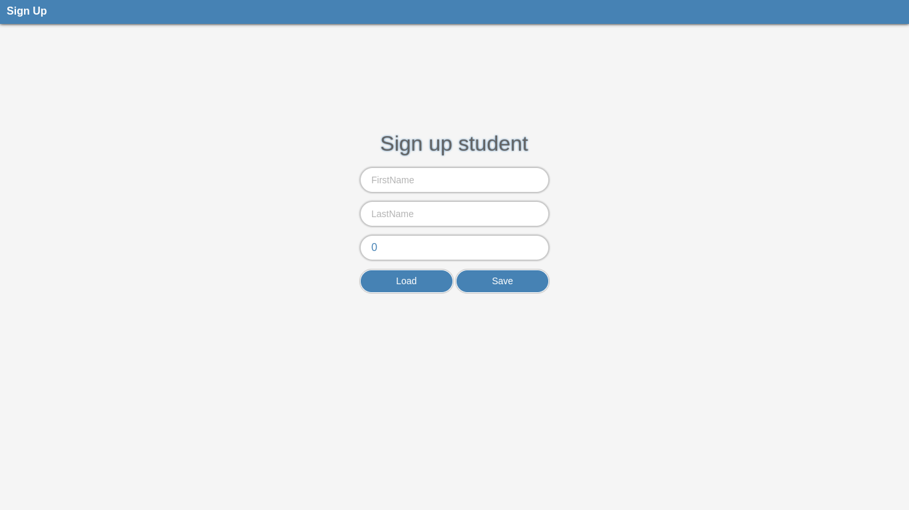
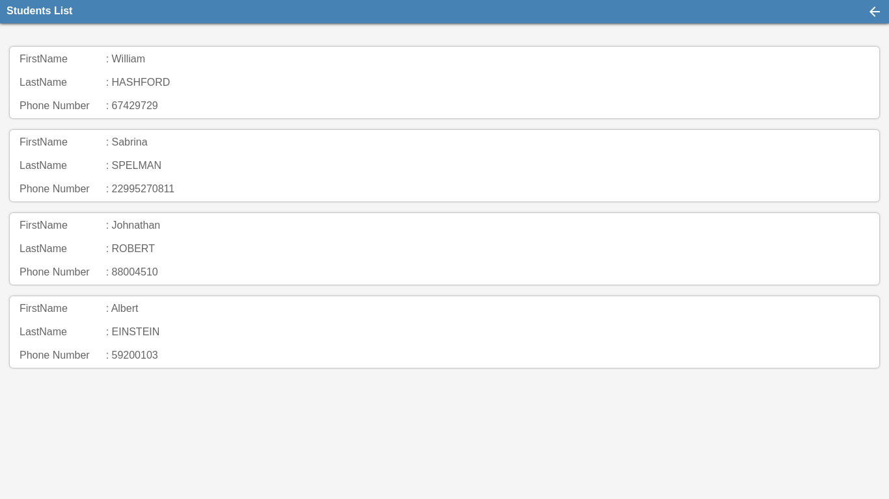

# Simple Student Saver


This small project is academic. It has been developed with Native Web Development
Languages. The main goal of the project is to save a student data inside a
Database. The project is subdivided in two parts such as: Front-end and
Back-end. In Front-end, we have two views: register and saved students pages.
Theses pages are using basic HTML and CSS to draw layouts, controls and
JavaScript to make some HTTP requests to Back-end via Node.js. In students
data page, a JavaScript functional component is built to draw each specific
student data with animation effects attached to that. In Back-end, a simple
Node.js API is developed to get and treat client requests. Express.js is used
as a server to run this project. Note that each student data is stored into a
local Database called SQLite. The communication between Front-end and Back-end
uses AJAX and data transfer uses JSON language.

## Table of contents
1. [Access link](#link)
2. [Reference](#ref)
3. [Final result](#result)
    1. [Video](#video)
    2. [Screenshots](#images)
4. [Project installation](#install)
    1. [Nodejs installation](#node-install)
    2. [Sources code cloning](#cloning)
    3. [Dependencies installation](#dev-install)
    4. [Project execution](#running)

## Access link <a id = "link"></a>
The project is already hosted on web and can be
accessible through the link below :
- https://simple-student-saver.onrender.com

## Reference <a id = "ref"></a>
The project can be found via the link below :
- https://gitlab.com/obrymec/simple_student_saver

## Final result <a id = "result"></a>
This is the final result of the project :
### Video <a id = "video"></a>
[](https://youtu.be/6vv_dhTlSUA)

### Screenshots <a id = "images"></a>



## Project installation <a id = "install"></a>
👉 If you want to get project sources code, make sure
to have <i><a href = "https://nodejs.org/en/download">
NodeJs</a></i> already installed in your machine. If
it isn't the case, you can install it from <i>
<a href = "https://github.com/nvm-sh/nvm">nvm</i></a>.

### Nodejs installation <a id = "node-install"></a>
```sh
cd ~;\
sudo apt install curl;\
curl https://raw.githubusercontent.com/creationix/nvm/master/install.sh | bash;\
source ~/.bashrc;\
nvm --version;\
nvm install --lts;\
node --version;\
npm install yarn --global;\
yarn --version
```

### Sources code cloning <a id = "cloning"></a>
```sh
git clone git@github.com:obrymec/simple_student_saver.git student_saver/
```

### Dependencies installation <a id = "dev-install"></a>
Go to the root folder of the project sources
and run :
```sh
yarn install
```

### Project execution <a id = "running"></a>
Go to the root folder of the project and
run :
```sh
yarn start
```

Then, open your favorite browser and tap
on the search bar, the following link :
```sh
http://localhost:5000/
```

If you want to navigate between views,
you can provide the following links :
```sh
http://localhost:5000/students
http://localhost:5000/sign-up
```

Enjoy :)
